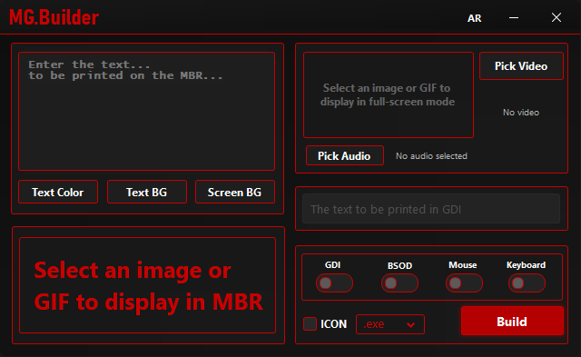

# MG.Builder

Builds a custom Windows executable you can drop on a friend's machine as a prank. You configure what it does inside the builder, hit build, and hand them the file.

---

## What each option does

**MBR Text / MBR Image**
After the machine reboots, whatever you put here shows up on screen. Text lets you pick colors from the BIOS palette. If you load an image instead, the text gets ignored and the image goes to disk directly.

**Screen Image / GIF / Video**
The moment the target opens the file, this takes over the whole screen. There's no way to close it from their end. Mouse and keyboard lock turn on by themselves when you pick this. Videos loop until something else stops them. Picking this disables GDI.

**Audio**
Loads a sound file that starts playing on launch. No BSOD — it loops. BSOD on — it plays once and then the blue screen fires.

**Mouse Lock / Keyboard Lock**
Cuts off mouse movement and keyboard input right away. Both work at the same time.

**GDI**
Throws visual effects on the screen. Doesn't work alongside the screen image or video options — picking either one of those turns GDI off automatically.

**BSOD**
Causes an actual blue screen. When it hits depends on what else is running:

- Nothing else — almost immediate
- Image alone — 15 seconds then blue screen
- GIF alone — one full loop then blue screen
- Audio alone or audio with image — audio finishes then blue screen
- Video — video finishes then blue screen

---

## Mixing options

Image and audio run together — image stays on screen while the audio plays, and with BSOD on it waits for the audio to end before firing. GDI and BSOD work fine together, GDI runs for a bit before the blue screen kicks in. GDI and screen image can't run at the same time, the builder handles that automatically.

---

## Disclaimer

Built for pranking people who are in on it or at least won't be seriously harmed by it. Using this on someone's machine without their knowledge is not something the author endorses or takes responsibility for. Any damage, lost data, or legal trouble that comes out of misuse is on whoever ran it.

---

## Requirements

Windows 10 or Windows 11. The output file needs administrator rights to run — without them it just exits.
